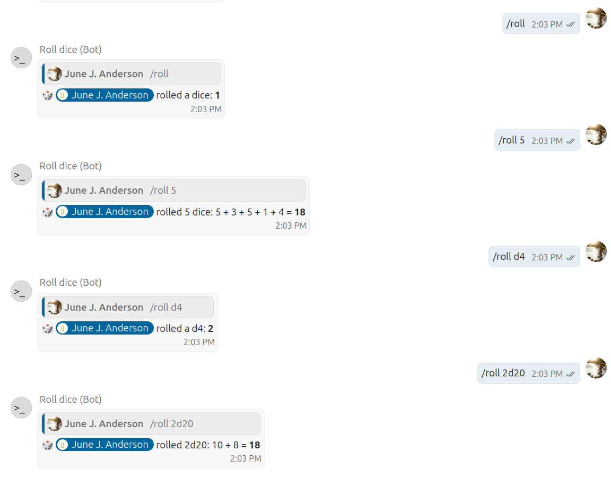

# 🎲 Roll Dice Bot for Nextcloud Talk

A simple bot to roll a die and receive true random results.
Also supports throwing multiple dice or dice with less or more results:

| Message      | Result                                |
|--------------|---------------------------------------|
| `/roll`      | Throw a single "normal" six-sided die |
| `/roll 3`    | Throw three "normal" six-sided dice   |
| `/roll d5`   | Throw a single five-sided die         |
| `/roll 2d20` | Throw two twenty-sided dice           |

